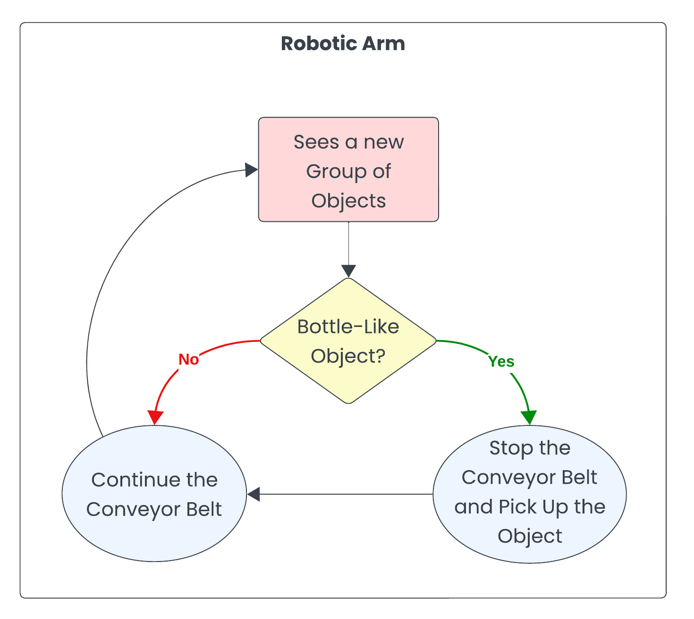

# Smart Recycling System

This is a senior design team project that addresses the issue of waste management by designing a robotic trash sorting system. The system enhances recycling efforts by sorting plastic bottles from landfill waste and incorporating a detection mechanism for special objects. Our design also communicates with users through a mobile application, providing real-time updates on the sorting process.


Here's a video demo of the project: 

[https://youtu.be/Xi2meyXaQEU?si=OMaDmnrADaCCsMfP](https://youtu.be/Xi2meyXaQEU?si=OMaDmnrADaCCsMfP)

This GitHub repository only stores the code for the special object detection part. Please visit the Helpful Links section for more details about it.

## Collaborator
* **Elijah Peralta** - evperalta@ucdavis.edu
* **Pinhao Hong** - cdghong@ucdavis.edu
* **Tao Wang** - taowang@ucdavis.edu
* **Taewoo Kim** - twkim@ucdavis.edu

## High-Level Goal

**Special Object Detection**


**Robotic Arm**



## Implementation

**Special Object Detection**
1. Users upload a label representing the special object they want to find (EX: Cat) in a file labels.json to the AWS **S3 Bucket**.
2. Raspberry Pi uploads the top-view image of the conveyor belt to the S3 Bucket continuously.
3. The AWS **Lambda** function sends the Raspberry Pi image to the AWS **Rekognition**.
4. Lambda checks if the user label matches with the object labels detected by Rekognition.
5. If the labels match, Lambda asks AWS Pinpoint to push a message to the user's mobile app and AWS IoT Core to publish the stop message that stops the Raspberry Pi from taking more images. 
6. If the labels don't match, nothing happens and the Raspberry Pi will continue to send images to AWS S3. GPIO Pin 5 turns on and GPIO Pin 6 turns off.
7. Note that once the Raspberry Pi stops, the user can publish a message to the IoT Topic to ask it to continue. GPIO Pin 6 turns on and GPIO Pin 5 turns off.


**Robotic Arm**
* The robotic arm's setup and implementation are not included in this GitHub Repository, but how it generally works is illustrated below.

1. The laptop connects to the Teensy microcontroller via USB.
2. Before we can run any program, the Teensy microcontroller calibrates the robotic arm through the limit switches. The limit switches help the arm to go back to its standby position.
3. When the user instructs the joint of the robot to move via the app on the laptop, Teensy uses the Stepper Driver to run the motor and move the robot's joint. The encoder helps Teensy to move the motor precisely.
4. The laptop controls the Arduino Nano to use the relay and solenoid valve to open and close the gripper.


## List of Material
* Raspberry Pi 4B
* Pi Camera
* AWS Account
* Mobile App with Android Studio to run the simulator

## File Structure
* **AWS_IoT**: contains the code that runs on the Raspberry Pi.
* **Arduino1Test**: contains the mobile app. Note that the app needs the Amplify configurations json file for logging into the cloud service. Visit the Helpful Links section for more details.
* **AWS_Lambda**: contains the Python script that runs on AWS Lambda.
    * lambda1: takes care of image recognition from Pi's image and push notification.
    * lambda2: takes care of the user controlling Raspberry Pi through uploading a txt file from the mobile app.

## Acknowledgment
This project serves as our Senior Design Project that fulfills the EEC175AB IoT Senior Design Series from the University of California, Davis. View the course description at [https://ece.ucdavis.edu/course-catalog](https://ece.ucdavis.edu/course-catalog).

Special thanks to 
* Professor **Avesta Sasan** and Teaching Assistant **Banafsheh Saber Latibari** for guidance during Winter 2024 over this project.
* **Chris Annin** from Annin Robotics for kindly sharing the open-source software and hardware of the AR3 robotic arm.

## Helpful Links
* **Raspberry Pi**: follow the [Connect a Raspberry Pi](https://docs.aws.amazon.com/iot/latest/developerguide/connecting-to-existing-device.html) instruction from AWS to set up the IoT device and get familiar with the AWS IoT Core.
* **Pi Camera**: use the command ```$ libcamera-hello``` in Raspberry Pi's terminal to test if the camera is working.
* **Mobile App**: follow the [AWS Amplify Documentation](https://docs.amplify.aws/android/) to configure the AWS connection in the Android App. This enables the upload to S3 and push notification.
* **Robotic Arm**: visit [Annin Robotics](https://www.anninrobotics.com) to learn more about the AR3 robotic arm we are using. The DOWNLOADS tab has all of the instructions on how to build the robot and the software source codes.
